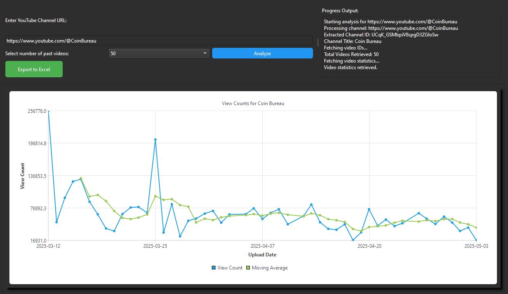

# YouTube View Statistics Dashboard

A PyQt6 desktop application that fetches YouTube channel view‐count data (via the YouTube Data API v3), visualizes trends, and allows exporting to Excel.

| Author     | Year |
|------------|------|
| Naadir D   | 2024 |

## Table of Contents

- [Features](#features)  
- [Requirements](#requirements)  
- [Installation](#installation)  
- [Obtaining a YouTube API Key](#obtaining-a-youtube-api-key)  
- [Configuration](#configuration)  
- [Usage](#usage)  
- [How It Works](#how-it-works)  
- [Exporting to Excel](#exporting-to-excel)  
- [Logging](#logging)  

---



## Features

- Enter any YouTube channel URL (standard, custom, or handle)  
- Choose number of past videos (50, 100, …, up to 1000, or “All”)  
- Interactive line chart of individual view counts plus a moving average  
- Zoom, pan, and reset via mouse interactions  
- Export full dataset and chart into a styled Excel workbook  

## Requirements

- Python 3.8+  
- A valid YouTube Data API v3 key  
- Packages (install via `pip install -r requirements.txt`):  
  - `google-api-python-client`  
  - `pandas`  
  - `numpy`  
  - `PyQt6`  
  - `openpyxl`  

## Installation

1. **Clone the repository**  
   ```bash
   git clone https://github.com/YourUsername/your-repo-name.git
   cd your-repo-name
   ```

2. **Create a virtual environment (optional but recommended)**  
   ```bash
   python3 -m venv venv
   source venv/bin/activate   # on Windows: venv\Scripts\activate
   ```

3. **Install dependencies**  
   ```bash
   pip install -r requirements.txt
   ```

## Obtaining a YouTube API Key

1. Go to the [Google Cloud Console](https://console.cloud.google.com/).  
2. Create or select an existing project.  
3. In “APIs & Services” → “Library”, enable the **YouTube Data API v3**.  
4. In “APIs & Services” → “Credentials”, click **Create credentials** → **API key**.  
5. Copy the generated key.

## Configuration

1. Create a file named `api.txt` in the project root.  
2. Paste your API key into `api.txt` (no extra whitespace).  
3. Save and close.

## Usage

1. **Run the application**  
   ```bash
   python main.py
   ```
2. **In the GUI**  
   - Paste your target channel URL (e.g. `https://www.youtube.com/@YourChannel`).  
   - Select how many past videos to analyze.  
   - Click **Analyze** to fetch data and render the chart.  
   - When the chart appears, you can zoom/pan with your mouse.  
   - Double‑click the chart to reset zoom.  
   - Once data is loaded, click **Export to Excel** to save an `.xlsx` file.

## How It Works

1. **API Client Initialization**  
   - Reads your key from `api.txt` and builds the YouTube API client.  
2. **URL Parsing**  
   - Detects `/channel/` IDs directly, resolves custom URLs (`/c/` or `/user/`), and handles handle URLs (`/@`).  
3. **Data Retrieval**  
   - Fetches the “uploads” playlist ID, then pages through playlist items to collect video IDs (all or last _n_).  
   - Batches calls to `videos.list` for view counts, titles, and publish dates.  
4. **Data Processing**  
   - Loads data into a `pandas.DataFrame`.  
   - Converts ISO timestamps to Python `datetime`, sorts, and computes a rolling mean.  
5. **Visualization**  
   - Uses **PyQt6.QtCharts** to plot view counts and moving average.  
   - Adds interactive tooltips, zoom/pan, and a drop shadow for polish.  
6. **Export**  
   - Converts the DataFrame to Excel via **openpyxl**, styles headers, and embeds a line chart in the sheet.

## Exporting to Excel

- Creates a workbook named:  
  ```
  <ChannelTitle>-<nVideos>-YYYYMMDD.xlsx
  ```
- Includes all raw statistics and an embedded chart.  
- Headers are bolded for readability.

## Logging

- All debug/info/error messages are written to `youtube_dashboard.log` in the app folder.  
- Useful for troubleshooting API errors, SSL retries, or unexpected failures.
